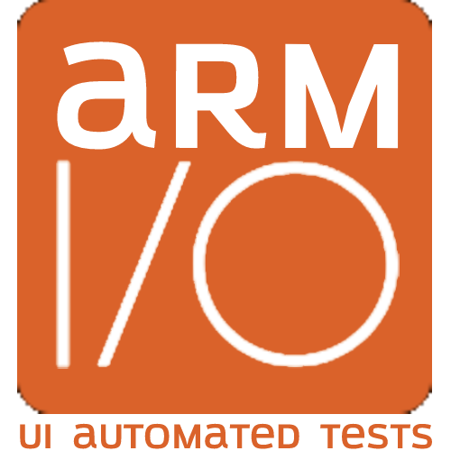

# arm-wdio-web

# Installing from the Ground up

Run the shell script `./install_wdio_from_ground_up.sh` to get installed WebDriver.IO as well as the dependencies:

```bash
    sh install_wdio_from_ground_up.sh
```

Once you have installed the Node modules, a test example will be created automatically and you can remove all of these files at `./test/pageobjects` and `./test/specs` if you want:

```
    test
    └─── pageobjects
    │   |  login.page.js
    │   |  page.js
    │   |  secure.page.js
    │
    └─── specs
        |   example.e2e.js

```
Those files are already being ignored by `.gitignore`. Just remove them locally as mentioned before. Any other file would cause failure in the Automation Practice tests if you remove them though.

# Running the Tests

After the previous set up, now you are able to execute the tests through `run_wdio.sh`:

```bash
    sh run_wdio.sh
```

If you want to execute some specific test case, you can run the command with custom .js test:

```bash
    npx wdio run ./wdio.conf.js --spec <YOUR_TEST_NAME>.js
```